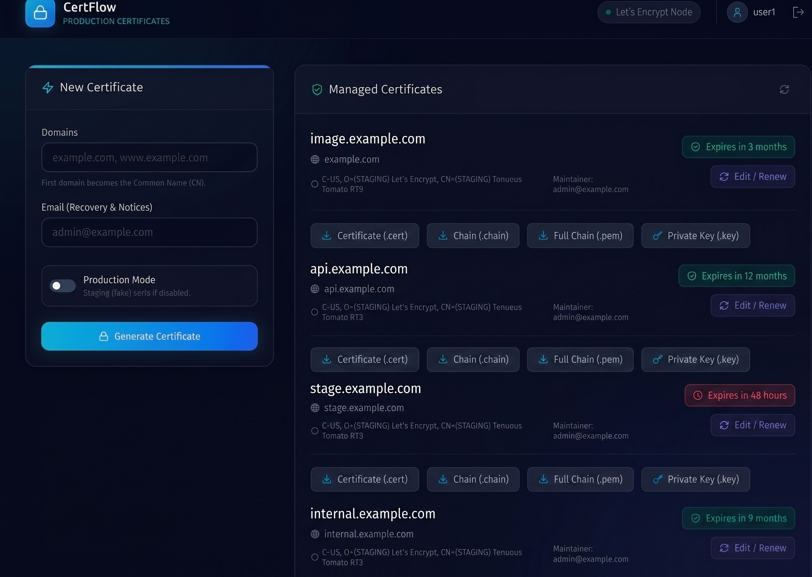

<div align="center">
  
  <br />
  <br />
  <h1>🌊 CertFlow</h1>
  <p><strong>Premium, Stunning, and Automated Let's Encrypt SSL Manager</strong></p>
  
  <p>
    
    
    
    
    
  </p>

  <p align="center">
    CertFlow is a professional-grade certificate management platform designed for developers who value both <strong>security</strong> and <strong>aesthetics</strong>. Skip the complex CLI commands and manage your SSL lifecycle through a gorgeous, glassmorphic dashboard.
  </p>
</div>

---

## ✨ Key Features

- 💎 **Ultra-Premium UI**: Fully responsive dark-mode dashboard built with Framer Motion and TailwindCSS.
- 🔐 **Production Ready**: One-click generation of trusted Let's Encrypt certificates via ACME DNS-01.
- 🌍 **Wildcard & Multi-Domain**: Comprehensive support for SANs and wildcard certificates (`*.domain.com`).
- 🔄 **Smart Renewal**: Easily track expiration dates and renew/edit existing certificates in seconds.
- 📦 **Docker Optimized**: Zero-config deployment with persistent volume support for your certs.
- 🛠 **Full Control**: Download Private Keys, Leaf Certs, Intermediate Chains, and Full Chains separately.

## 🛠 Tech Stack

- **Frontend**: [React](https://reactjs.org/) + [Vite](https://vitejs.dev/) + [TailwindCSS](https://tailwindcss.com/)
- **Backend**: [Node.js](https://nodejs.org/) + [Express](https://expressjs.com/)
- **Animation**: [Framer Motion](https://www.framer.com/motion/)
- **ACME Logic**: [acme-client](https://github.com/publishlab/node-acme-client)
- **Icons**: [Lucide React](https://lucide.dev/)

## 🚀 Getting Started

### 🐋 Run with Docker (Recommended)
The easiest way to get CertFlow running is using Docker Compose:

```bash
docker-compose up -d
```
Your dashboard will be live at `http://localhost:3000`.

### 💻 Manual Installation

1. **Clone & Install**
   ```bash
   git clone https://github.com/datwanikanaiya-beep/CertFlow.git
   cd CertFlow
   npm install
   ```

2. **Environment Setup**
   Copy `.env.example` to `.env` and set your `JWT_SECRET`.

3. **Start Development**
   ```bash
   npm run dev
   ```

## 📖 How it Works

1. **Request**: Enter your domains and email. Choose "Production" for real certificates.
2. **DNS Challenge**: CertFlow provides the exact TXT records you need to add to your DNS provider.
3. **Verification**: Once your records propagate, click "Verify".
4. **Download**: Securely download your `.cert`, `.key`, and `.chain` files immediately.

---

## 🤝 Contributing
Contributions are welcome! Feel free to open issues or submit pull requests to help make CertFlow the best open-source SSL manager.

## 📄 License
MIT License. Free for everyone.

---

<p align="center">
  <i>Developed with ❤️ for the developer community.</i>
</p>
